# WhatsApp CRM Bridge for Odoo 18 Community

A portfolio-grade Odoo 18 Community module that connects a Meta WhatsApp Cloud API integration concept with Odoo CRM.

The module turns WhatsApp customer messages into structured CRM leads, trackable message records, operational conversations, salesperson follow-up workflows, and Odoo-native reporting dashboards.

> This project is built as a portfolio MVP. It demonstrates integration architecture, Odoo backend development, CRM workflow customization, webhook handling, and reporting design. It is not presented as production-ready software.

---

## Project Summary

Many businesses receive most of their sales inquiries on WhatsApp, while their official sales pipeline lives inside Odoo CRM.

Without an integration layer, WhatsApp conversations remain outside the CRM workflow. Salespeople lose context, managers cannot track response activity, and customer follow-up becomes difficult to audit.

`whatsapp_crm_bridge` solves this by introducing a structured WhatsApp CRM layer inside Odoo:

* WhatsApp webhook events are received and logged.
* Customer phone numbers are normalized and matched to Odoo partners.
* CRM leads are created or reused automatically.
* Inbound and outbound WhatsApp messages are stored as durable records.
* Conversations group messages into an operational follow-up queue.
* Salespeople can reply manually from CRM leads or conversations.
* Managers can analyze messages, statuses, conversations, and webhook events through Odoo list, pivot, and graph views.

---

## Screenshots

### WhatsApp Account Configuration

Configure a WhatsApp account with Meta API metadata, webhook settings, masked credentials, and connection status.

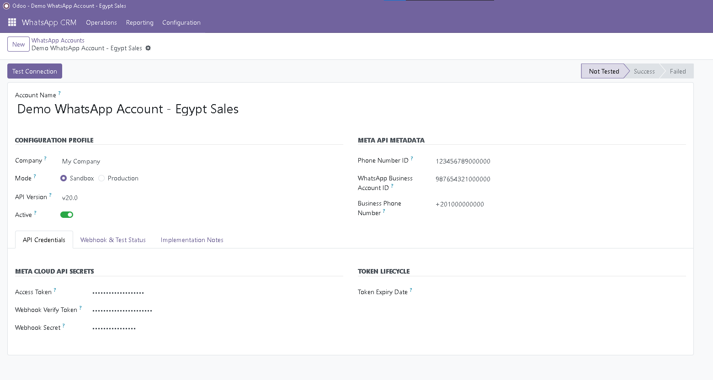

---

### WhatsApp Conversations

Operational conversation queue for sales teams, showing state, customer, CRM lead, salesperson, account, message count, and follow-up context.

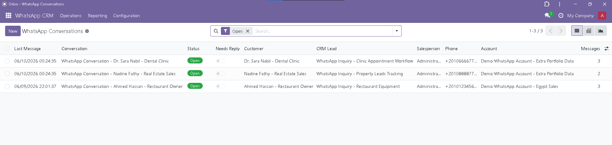

---

### Conversation Follow-up Workflow

A conversation form groups customer details, CRM lead, account, lifecycle state, messages, and follow-up actions in one operational screen.

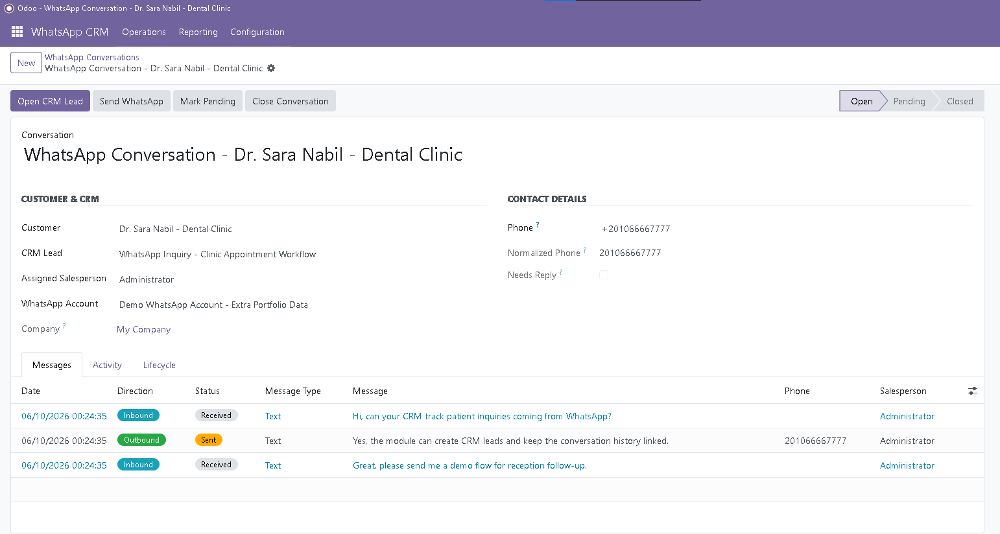

---

### Manual WhatsApp Reply Wizard

Salespeople can send a manual WhatsApp text reply from a conversation or CRM lead using the same reusable wizard.

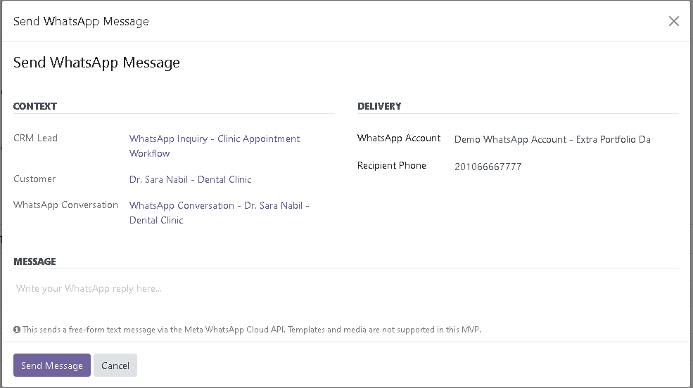

---

### CRM Lead Integration

CRM leads are extended with a WhatsApp send action and a smart button for related WhatsApp conversations.

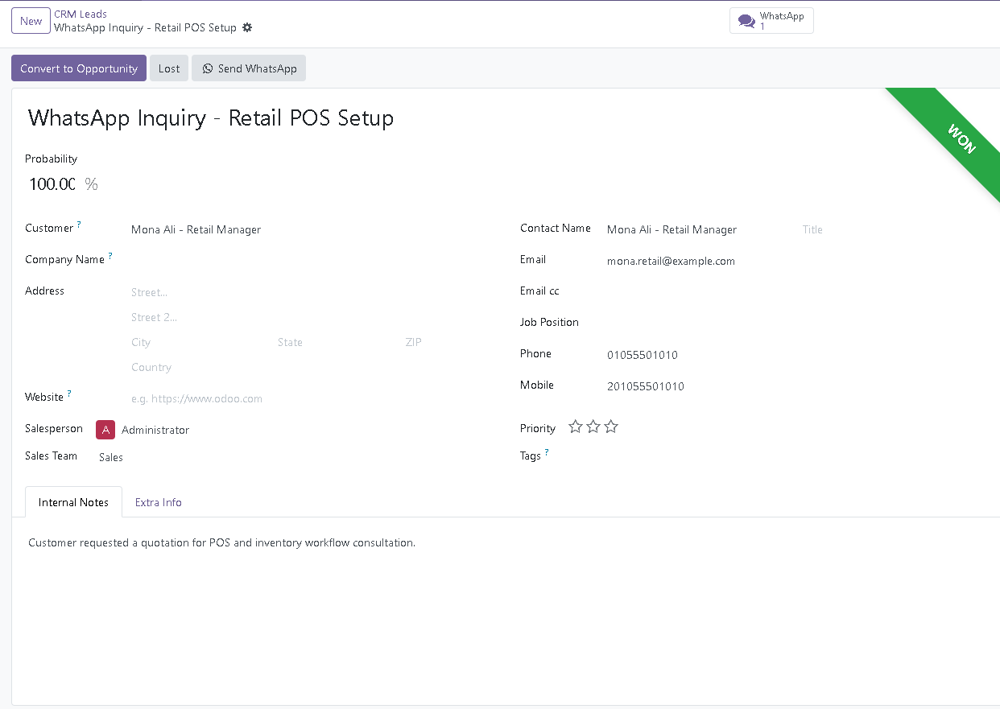

---

### WhatsApp Message Tracking

Durable message records track inbound/outbound direction, delivery status, CRM lead, customer, conversation, salesperson, and account.

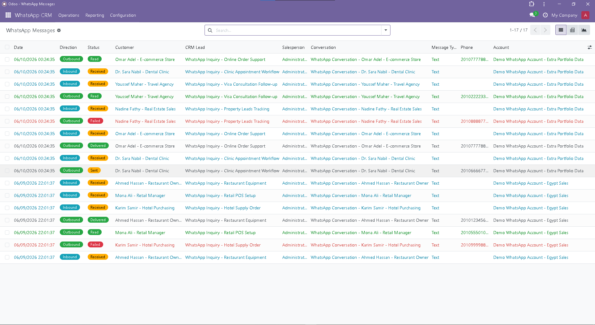

---

### Message Detail View

Each WhatsApp message has a business overview, CRM linkage, status timeline, and technical payload section.

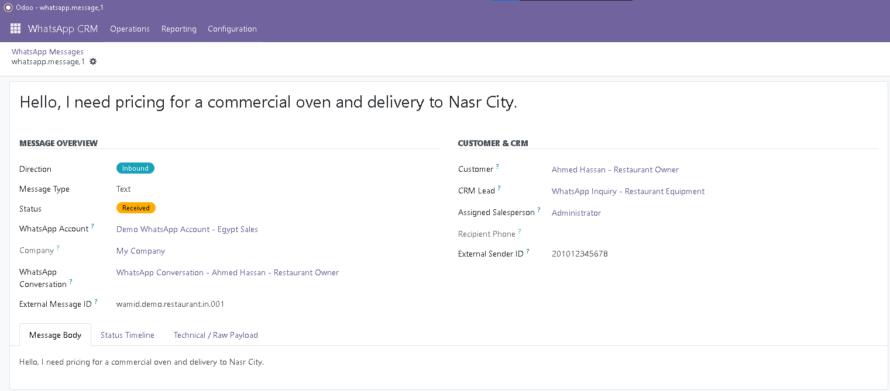

---

### Webhook Event Audit

Raw webhook events are stored as an audit/debug layer with processing status, sender details, matched customer, lead, and salesperson.

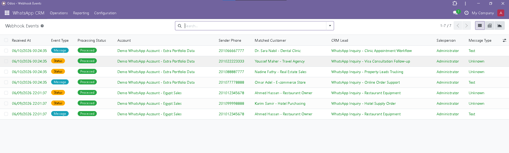

---

### Webhook Event Details

Webhook event forms separate event summary, processing result, matching result, message content, and raw payload preview.

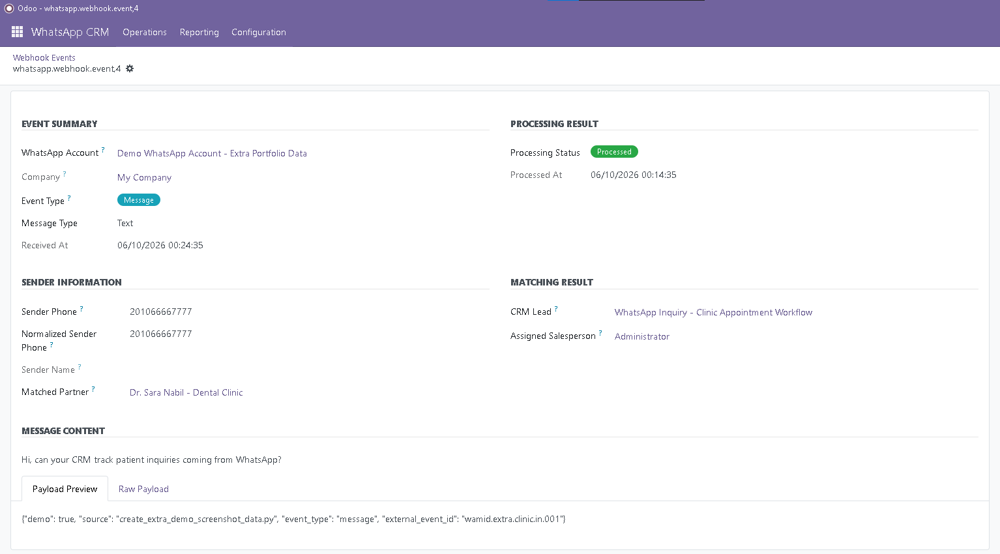

---

### Message Analysis

Odoo-native pivot reporting for WhatsApp message counts by direction, status, and date.

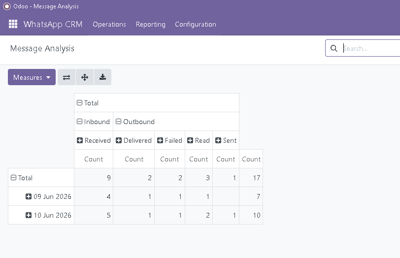

---

### Conversation Analysis

Conversation reporting by lifecycle state, helping managers understand open, pending, and closed WhatsApp conversations.

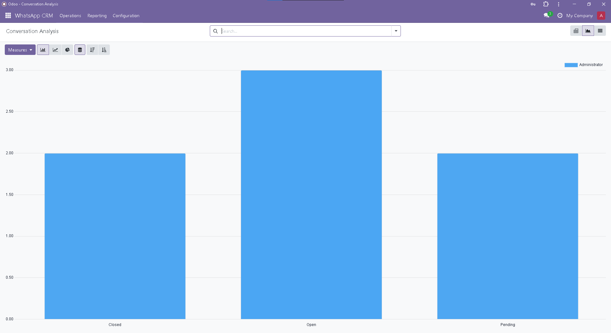

---

## Key Features

### 1. WhatsApp Account Configuration

* Configure WhatsApp Business account metadata.
* Store Meta API version, phone number ID, WABA ID, and business phone number.
* Configure webhook verify token and optional webhook secret placeholder.
* Track account mode: sandbox or production.
* Track connection state for demo/test visibility.
* Mask sensitive token fields in the Odoo form.

---

### 2. Webhook Verification and Inbound Webhook Handling

* Implements Meta webhook verification through:

```text
/whatsapp/webhook
```

* Supports external webhook calls without an Odoo browser session.
* Supports explicit database resolution for local testing:

```text
/whatsapp/webhook?db=whatsapp_crm_bridge
```

* Stores received webhook data in a raw audit model.
* Logs webhook hits without printing sensitive query parameters or tokens.

---

### 3. Partner Matching

Egypt-focused phone normalization is implemented for the portfolio MVP.

Examples:

```text
01012345678     -> 201012345678
+201012345678   -> 201012345678
00201012345678  -> 201012345678
```

Inbound WhatsApp messages are matched to existing Odoo partners when possible. If no partner exists, the module creates a new customer record.

---

### 4. CRM Lead Creation and Reuse

Inbound WhatsApp messages are linked to Odoo CRM.

The module can:

* Create a new CRM lead from an inbound WhatsApp inquiry.
* Reuse an existing open WhatsApp-related CRM lead.
* Link the lead to the matched customer.
* Assign the lead salesperson to related WhatsApp messages and conversations.
* Post safe CRM chatter notes for inbound WhatsApp activity.

---

### 5. Durable WhatsApp Messages

The module introduces a real `whatsapp.message` model instead of relying only on raw webhook logs.

This is important because Meta status updates arrive later and need a durable message record to update.

Tracked message information includes:

* Account
* Company
* Customer
* CRM lead
* Conversation
* Assigned salesperson
* Direction: inbound or outbound
* Message type
* Message body
* External Meta message ID
* Recipient phone
* External sender ID
* Status: draft, received, sent, delivered, read, failed
* Error code and error message
* Raw payload
* Sent, received, delivered, read, and failed timestamps

---

### 6. Message Status Updates

The module handles WhatsApp status webhooks and updates message records by:

```text
account_id + external_message_id
```

Supported statuses include:

* Sent
* Delivered
* Read
* Failed

Unmatched status webhooks are safely logged and ignored while still returning a successful HTTP response to Meta.

---

### 7. Conversation Management

The module introduces `whatsapp.conversation` as the operational layer between messages and CRM leads.

A conversation tracks:

* Customer
* Phone and normalized phone
* WhatsApp account
* CRM lead
* Assigned salesperson
* State: open, pending, closed
* Message count
* Inbound and outbound counts
* Last inbound message date
* Last outbound message date
* Last message date
* Needs-reply indicator
* Close reason
* Closed by
* Closed at
* Last lifecycle note
* Last state change details

Conversation matching uses:

```text
account_id + normalized_phone + state in open/pending
```

If a conversation is closed and the same customer sends a new inbound message, a new conversation can be created.

---

### 8. Conversation Follow-up Actions

Salespeople can work directly from the conversation screen.

Available actions include:

* Open related CRM lead.
* Send WhatsApp message using the existing send wizard.
* Mark conversation as pending.
* Mark conversation as open.
* Close conversation.
* Reopen conversation.

Outbound messages sent from a conversation are linked back to the same conversation when possible.

---

### 9. CRM Lead Extension

The module extends CRM leads with WhatsApp operations.

CRM lead additions include:

* Send WhatsApp button.
* WhatsApp Conversations smart button.
* Related conversation access from the CRM lead.
* WhatsApp CRM navigation shortcut to CRM leads.

The standard CRM flow is preserved.

---

### 10. Reporting

The module uses Odoo-native list, search, pivot, and graph views.

Reporting is available for:

* WhatsApp messages
* WhatsApp conversations
* Webhook events

Useful reporting dimensions include:

* Message direction
* Message status
* Salesperson
* Customer
* CRM lead
* Conversation state
* Webhook event type
* Webhook processing status
* Account
* Creation date

---

## Application Menu Structure

The module is organized as a business app:

```text
WhatsApp CRM
├── Operations
│   ├── Conversations
│   ├── CRM Leads
│   ├── Messages
│   └── Webhook Events
├── Reporting
│   ├── Message Analysis
│   ├── Webhook Analysis
│   └── Conversation Analysis
└── Configuration
    └── WhatsApp Accounts
```

---

## Architecture Overview

The module separates the integration into four clear layers.

| Layer                          | Model                    | Purpose                                                                                |
| ------------------------------ | ------------------------ | -------------------------------------------------------------------------------------- |
| Raw audit/debug layer          | `whatsapp.webhook.event` | Stores webhook payloads, processing status, extracted metadata, and matching results.  |
| Durable message layer          | `whatsapp.message`       | Stores inbound/outbound messages and delivery/read/failure status updates.             |
| Operational conversation layer | `whatsapp.conversation`  | Groups messages into sales follow-up conversations with ownership and lifecycle state. |
| Sales pipeline layer           | `crm.lead`               | Represents the sales lead or opportunity created/reused from WhatsApp inquiries.       |

---

## Main Odoo Models

| Model                          | Purpose                                                         |
| ------------------------------ | --------------------------------------------------------------- |
| `whatsapp.account`             | WhatsApp Business account configuration and Meta API metadata.  |
| `whatsapp.webhook.event`       | Raw webhook audit log and processing trace.                     |
| `whatsapp.message`             | Durable inbound/outbound WhatsApp message record.               |
| `whatsapp.conversation`        | Operational customer conversation and follow-up layer.          |
| `whatsapp.send.message.wizard` | Manual text reply wizard used from CRM leads and conversations. |
| `crm.lead`                     | Extended Odoo CRM lead with WhatsApp actions and smart button.  |

---

## End-to-End Demo Flow

A typical demo scenario:

1. Configure a WhatsApp account in Odoo.
2. Meta verifies the webhook endpoint.
3. A customer sends a WhatsApp message.
4. Odoo receives the inbound webhook.
5. The raw webhook event is stored.
6. The sender phone is normalized.
7. Odoo matches or creates a customer.
8. Odoo creates or reuses an open CRM lead.
9. Odoo creates or reuses a WhatsApp conversation.
10. A salesperson opens the conversation queue.
11. The salesperson opens the related CRM lead or replies directly from the conversation.
12. The outbound WhatsApp message attempt is stored.
13. Meta status webhooks update message status to sent, delivered, read, or failed.
14. The conversation can be marked pending, closed, or reopened.
15. Managers review message, conversation, and webhook reports.

---

## Local Setup

### 1. Clone into Odoo Addons Path

Clone the repository into your Odoo custom addons path.

Example:

```bash
C:\odoo18\dev\whatsapp_crm_bridge
```

### 2. Ensure Dependencies

The module is designed for:

```text
Odoo 18 Community
```

Required Odoo apps include:

* CRM
* Mail

### 3. Upgrade the Module

```bash
python odoo-bin -c odoo.conf -d whatsapp_crm_bridge -u whatsapp_crm_bridge --stop-after-init --max-cron-threads=0 --db-filter=^whatsapp_crm_bridge$
```

### 4. Run Odoo Locally

```bash
python odoo-bin -c odoo.conf -d whatsapp_crm_bridge --max-cron-threads=0 --db-filter=^whatsapp_crm_bridge$ --http-port=8070
```

Then open:

```text
http://localhost:8070
```

---

## Demo Screenshot Database

For portfolio screenshots, use a separate demo database:

```text
whatsapp_crm_bridge_demo
```

Upgrade the module on the demo database:

```bash
python odoo-bin -c odoo.conf -d whatsapp_crm_bridge_demo -u whatsapp_crm_bridge --stop-after-init --max-cron-threads=0 --db-filter=^whatsapp_crm_bridge_demo$
```

Run the demo server:

```bash
python odoo-bin -c odoo.conf -d whatsapp_crm_bridge_demo --max-cron-threads=0 --db-filter=^whatsapp_crm_bridge_demo$ --http-port=8070
```

The repository includes manually executed demo data scripts under:

```text
scripts/
```

These scripts are intended for local screenshot/demo databases only and are not loaded automatically during module installation.

---

## Meta Webhook Local Testing

The webhook route is:

```text
/whatsapp/webhook
```

For local testing with a tunnel such as ngrok, configure Meta with a callback URL like:

```text
https://<your-tunnel-host>/whatsapp/webhook?db=whatsapp_crm_bridge
```

Webhook verification expects Meta query parameters:

```text
hub.mode=subscribe
hub.verify_token=<WEBHOOK_VERIFY_TOKEN>
hub.challenge=<CHALLENGE_VALUE>
```

Inbound message and status payloads must include a WhatsApp `phone_number_id` matching an active `whatsapp.account`.

---

## Security Notes

This module is a portfolio-grade MVP and is not a hardened production deployment.

Security design notes:

* Access tokens and webhook secrets must use placeholders in demos and documentation.
* Token fields are masked in the Odoo form.
* Token fields should be restricted to integration/admin users.
* Form masking does not encrypt values in the database.
* Production deployments should use encrypted secret storage, environment variables, or a deployment secret manager.
* Webhook logs must not print access tokens, verify tokens, webhook secrets, or raw authorization headers.
* Raw webhook payloads may contain customer data and should be treated as restricted operational audit data.
* Webhook signature validation is not implemented in the current MVP.

---

## Known Limitations

The following limitations are intentional for this portfolio MVP:

* Odoo 18 Community only.
* Egypt-focused phone normalization only.
* Manual free-form text replies only.
* No WhatsApp template management.
* No media message support.
* No campaign or bulk messaging features.
* No live chat interface.
* No real-time bus notifications.
* No chatbot.
* No AI suggested replies.
* No SLA automation.
* No cron retry queue.
* No advanced assignment engine.
* No production secret manager integration.
* No webhook signature validation.
* Connection test is a local placeholder and not a full Meta API validation flow.

---

## Version Roadmap

### v0.1.0 — WhatsApp CRM Core

Implemented:

* WhatsApp account configuration
* Webhook verification
* Inbound webhook logging
* Partner matching
* CRM lead creation/reuse
* Manual reply wizard foundation

### v0.2.0 — Message Status and Assignment

Implemented:

* Durable WhatsApp message model
* Outbound message tracking
* Status update handling
* Salesperson assignment
* My/assigned/unassigned filters

### v0.3.0 — Conversations and Reporting

Implemented:

* Odoo-native reporting views
* Message analysis
* Webhook event analysis
* WhatsApp conversation model
* Conversation counters
* Needs-reply tracking
* Conversation ownership

### v0.4.0 — Conversation Operations and Portfolio Release

Implemented:

* Conversation follow-up actions
* Send WhatsApp from conversation
* CRM Lead smart button for conversations
* Conversation lifecycle management
* View UX polish
* Business-friendly menu structure
* CRM Leads menu inside WhatsApp CRM operations
* Demo data scripts
* Portfolio screenshots
* README and documentation polish

---

## Out of Scope for Current MVP

The following features are intentionally excluded to keep the MVP focused:

* WhatsApp templates
* Media messages
* Bulk campaigns
* Live chat UI
* Odoo bus real-time updates
* Chatbot flows
* AI reply suggestions
* SLA automation
* Advanced assignment rules
* Multi-country phone normalization
* Payment integration
* Website form integration

---

## Skills Demonstrated

This project demonstrates:

* Odoo 18 Community module development
* Odoo model design
* CRM customization
* Transient wizard development
* External webhook handling
* Meta WhatsApp Cloud API integration concept
* Partner matching and phone normalization
* Durable message tracking
* Operational conversation workflow design
* Odoo XML views, search views, pivot views, and graph views
* Odoo action/menu design
* Safe logging and token handling
* Portfolio demo preparation
* Git feature-branch workflow and release tagging

---

## Portfolio Positioning

This project is designed as a focused integration case study.

It shows how a business-critical messaging channel like WhatsApp can be connected to Odoo CRM in a structured way without building an oversized WhatsApp platform.

The goal is not to replace WhatsApp Business tools, but to demonstrate how inbound WhatsApp activity can become:

* CRM leads
* Customer records
* Trackable messages
* Salesperson-owned conversations
* Follow-up workflows
* Managerial reporting data

---

## Suggested Release Tag

```text
v0.4.0-whatsapp-crm-operations
```

This tag represents the portfolio-ready release of the WhatsApp CRM Bridge module.
